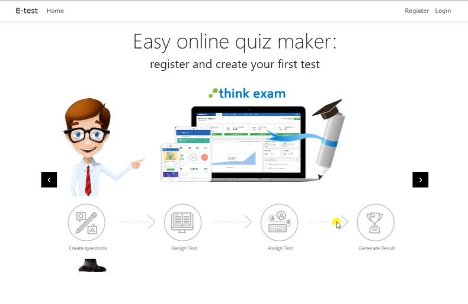

# E-test-app
# Веб апликација за креирање на електронски тестови

## Опис
Креирање на систем кој овозможува на корисниците да креираат профил и да креираат електронски тестови по нивните потреби.

## Функционалности
- Имплементација на функционалности за споделување на тестови
- Разработка на систем за оценување, каде што ако тестот се реши со 50% точност, системот автоматски генерира сертификат за корисникот.
- Интеграција на GemBox.Document за генерирање на сертификатите според податоците од профилот на корисникот.
- Имплементација на функционалност за експорт на резултатите од решавањето на тестовите во ексел табела.

## Видео презентација

<video width="320" height="240" controls>
  <source src="Images-videos/E-test Video.mp4" type="video/mp4">
  Вашиот прелистувач не поддржува HTML5 видео.
</video>
